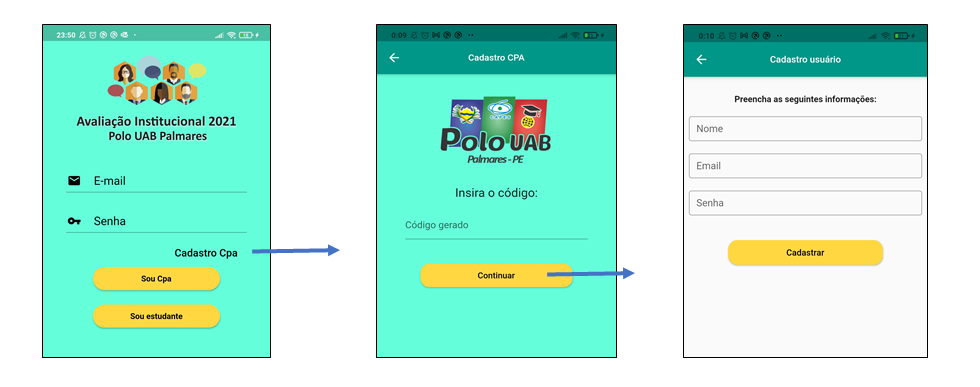

# App Avaliacao Institucional
Projeto da Disciplina PGIA 7310 - Fundamentos de Informática Aplicada UFRPE.

[](https://github.com/marconeslira)
[](http://dlirati.com.br)
[](https://www.youtube.com/marconeslira)

### SOBRE O APP
   Este App tem o objetivo de facilitar o processo de Avaliação Institucional, trazendo dois módulos, o de aluno onde os mesmos poderão responder o questionário previamente construído pela CPA (Comissão Própria de Avaliação) e o módulo CPA (gestor), onde apresentamos uma dash com informações, gráficos, estatísticas oriundas do resultado dos dados colhidos no módulo aluno, com o intuito de Inferir uma métrica de informações sobre principais pontos positivos e negativos da instituição e investigar possíveis alunos em situação de evasão, dificuldades e sugestões de melhorias. 

### INSTALAÇÃO (Dev)
  Para proceder com a instalação deste projeto para modificações será necessário:

  * Instalar o SDK [Flutter](https:\\flutter.dev) em sua versão mais atualizada;
  * Ter um Editor de Texto ex.[VSCode](https://code.visualstudio.com/) com as extensões [Flutter](https:\\flutter.dev) e Dart Instaladas;
  * Fazer o Download dos arquivos deste repositório;

  Caso deseje via Git use o seguinte código:

  ```git clone https://github.com/marconeslira/AppAvaliacaoInstitucional.git```

### INFORMAÇÕES DA ESTRUTURA DE LAYOUT (WIDGET TREE)

#### - Página Inicial


### - Página de Confirmação


### MAPAS DE NAVEGAÇÃO





### USO INICIAL

  Para acessar inicialmente o módulo de CPA (gestor) use o login e senha padrão:

  # Login: 
  admin@adm.com
  # Senha: 
  12345

### AJUDA

  Para obter ajuda entre em contato com o desenvolvedor através do email: 

  marconeslira@gmail.com

### ATUALIZAÇÃO

  Este repositório será atualizado conforme andamento e plano de mudanças do projeto.